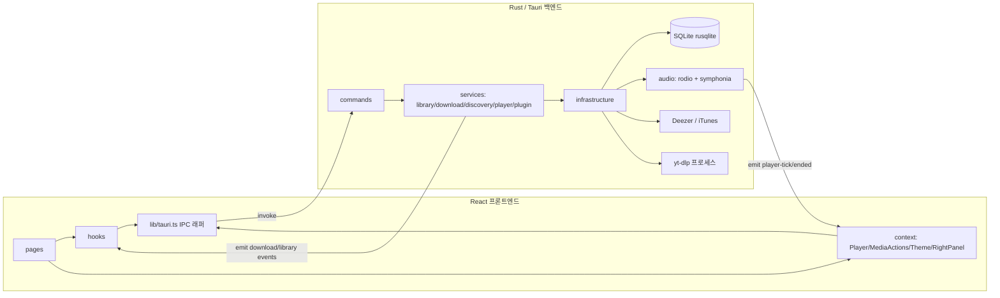

# aemeath-music 코드 진단 보고서

- 대상: `aemeath-music` (Tauri 2 + React 19 + Rust 데스크톱 음악 앱)
- 작성일: 2026-07-08
- 리뷰 범위: `src/` (프론트엔드), `src-tauri/src/` (백엔드), 빌드/설정 파일. 산출물(`dist/`, `src-tauri/target/`)과 `.git/`은 제외
- 목적: 코드 전반의 품질과 안정성 확보, 유지보수성 향상

---

## 1. 요약 (Executive Summary)

전반적으로 계층 분리(`commands` → `services` → `infrastructure`)가 명확하고, 오프라인 처리·이벤트 기반 진행률·캐시 등 실사용을 고려한 흔적이 많은 견실한 코드베이스입니다. 다만 **품질/안정성 관점에서 즉시 고칠 가치가 있는 결함**과 **유지보수성을 갉아먹는 구조적 중복**이 함께 존재합니다.

핵심 리스크를 세 갈래로 요약하면 다음과 같습니다.

1. **정확성 버그**: 레거시 DB 마이그레이션이 잘못된 테이블을 변경하고, 스캐너가 하위 디렉터리 오류 하나에 전체 실패합니다.
2. **크로스 플랫폼 불일치**: README는 Windows/macOS 릴리스를 명시하지만, yt-dlp 바이너리 다운로드와 다운로드 취소(`kill`)가 사실상 Linux(Unix) 전용입니다.
3. **경계 안전성**: `csp: null`, 무검증 원격 URL 페치(`fetch_preview`), 실행 바이너리 무결성 미검증, 다운로드 경로 검증 부족 등 신뢰 경계가 느슨합니다.

또한 **테스트/린트가 전무**하여 위 문제들이 회귀했을 때 조기에 잡을 수 없습니다.

### 심각도별 발견사항 집계

| 심각도 | 개수 | 대표 항목 |
|--------|------|-----------|
| P0 (즉시 수정 권장) | 4 | 마이그레이션 버그, 크로스 플랫폼, 무검증 페치, CSP |
| P1 (안정성/견고성) | 7 | 스캔 실패 전파, silent row drop, 매 진입 전체 재스캔 등 |
| P2 (유지보수성) | 4 | 상태 중복, String 에러, 테스트 부재, 헬퍼 중복 |
| P3 (성능/최적화) | 4 | O(n²) prune, 불필요 정렬, 위치 드리프트 등 |

---

## 2. 아키텍처 개요



레이어 경계는 잘 잡혀 있습니다. 아래 진단은 이 구조를 유지하는 전제에서 개선점을 제시합니다.

---

## 3. P0 — 즉시 수정 권장

### F-01. 레거시 `playlists` 마이그레이션이 엉뚱한 테이블(`tracks`)을 변경

`ensure_legacy_playlists_columns()`는 공용 헬퍼 `add_column_if_missing()`을 호출하지만, 이 헬퍼는 컬럼명과 무관하게 **항상 `ALTER TABLE tracks`** 를 실행합니다.

파일: `src-tauri/src/infrastructure/db/database.rs`

```rust
// ensure_legacy_playlists_columns() 내부
add_column_if_missing(conn, &columns, "description", "TEXT")?;
add_column_if_missing(conn, &columns, "created_at", "INTEGER NOT NULL DEFAULT 0")?;
add_column_if_missing(conn, &columns, "updated_at", "INTEGER NOT NULL DEFAULT 0")?;

// ...

fn add_column_if_missing(conn, columns, column_name, column_sql) -> Result<(), String> {
    if columns.contains(column_name) { return Ok(()); }
    conn.execute(
        &format!("ALTER TABLE tracks ADD COLUMN {column_name} {column_sql}"), // ← 항상 tracks
        [],
    )?;
    Ok(())
}
```

**영향**: `updated_at` 컬럼이 없는 구버전 `playlists` 테이블을 가진 사용자가 업그레이드하면,
1. `updated_at`이 `tracks`에 잘못 추가되고 `playlists`에는 여전히 없음
2. 이후 `run_migrations`의 `UPDATE playlists SET updated_at = created_at` 및 `playlist_list`의 `ORDER BY p.updated_at`이 "no such column"으로 실패
→ **앱 시작(마이그레이션) 또는 플레이리스트 화면이 통째로 깨짐**. 신규 설치에서는 조기 반환으로 트리거되지 않아 잠복하기 쉬운 회귀입니다.

**권장 수정**: 헬퍼에 테이블명을 인자로 받게 변경.

```rust
fn add_column_if_missing(conn, table: &str, columns, column_name, column_sql) -> Result<(), String> {
    if columns.contains(column_name) { return Ok(()); }
    conn.execute(&format!("ALTER TABLE {table} ADD COLUMN {column_name} {column_sql}"), [])?;
    Ok(())
}
```

> 근본 개선: 임시 `ALTER` 누적 방식 대신 `PRAGMA user_version` 기반의 순번 마이그레이션 러너를 도입하면 이런 부류의 실수를 구조적으로 차단할 수 있습니다.

---

### F-02. 크로스 플랫폼 불일치 (Windows/macOS에서 다운로드 기능 동작 불가)

README는 Windows(`.msi`/`.exe`), macOS(`.dmg`) 릴리스를 명시하지만 다운로드 경로가 Unix에 묶여 있습니다.

1. **yt-dlp 바이너리 URL/경로가 리눅스 전용**
   파일: `src-tauri/src/infrastructure/plugins/ytdlp.rs`
   ```rust
   const YTDLP_RELEASE_URL: &str =
       "https://github.com/yt-dlp/yt-dlp/releases/latest/download/yt-dlp"; // Linux 전용 파일
   pub fn binary_path() -> PathBuf { paths::tools_dir().join("yt-dlp") } // .exe 미고려
   ```
   Windows는 `yt-dlp.exe`, macOS는 `yt-dlp_macos` 자산이 필요하며, 실행 권한 설정(`0o755`)도 `#[cfg(unix)]`로만 처리됩니다.

2. **다운로드 취소가 외부 `kill` 명령에 의존**
   파일: `src-tauri/src/services/download.rs`
   ```rust
   let status = std::process::Command::new("kill")
       .arg("-TERM").arg(pid.to_string()).status()?; // Windows에 kill 없음
   ```

**권장 수정**: `cfg!(target_os)`로 다운로드 자산명/바이너리명을 분기하고, 취소는 크레이트(예: 프로세스 핸들 보관 후 `child.kill()`)나 플랫폼별 API로 처리. 실제 배포 타깃을 Linux로 한정한다면 README/`bundle.targets`를 그에 맞게 축소하는 것도 정합성 확보 방법입니다.

---

### F-03. `fetch_preview`의 무검증 원격 페치 (SSRF/캐시 오염 가능)

`discovery_fetch_preview` 커맨드는 렌더러가 넘긴 `preview_url`을 **스킴/호스트/Content-Type/크기 제한 없이** 그대로 받아 파일로 저장합니다.

파일: `src-tauri/src/services/discovery.rs`

```rust
pub fn fetch_preview(preview_url: &str, external_id: &str) -> Result<String, String> {
    // ...
    let bytes = client.get(preview_url).send()?.error_for_status()?.bytes()?; // 검증 없음
    file.write_all(&bytes)?; // 무엇이든 <id>.mp3 로 저장
}
```

**영향**: 커맨드가 IPC로 노출되어 있어 렌더러(또는 XSS로 침해된 렌더러)가 임의 URL로 호출 가능 → 내부망 주소 요청(SSRF), 대용량 응답으로 디스크 캐시 팽창, 비오디오 콘텐츠 저장.

**권장 수정**: `https`만 허용, 호스트 화이트리스트(`*.deezer.com`, `*.mzstatic.com` 등), 응답 `Content-Type`이 오디오인지 확인, `Content-Length`/누적 바이트 상한 적용.

---

### F-04. `csp: null` (Content Security Policy 비활성화)

파일: `src-tauri/tauri.conf.json`

```json
"security": {
  "csp": null,
  "assetProtocol": {
    "enable": true,
    "scope": ["$HOME/Music/**", "$HOME/.local/share/music-app/**"]
  }
}
```

앱은 Deezer/iTunes의 **원격 커버 이미지를 ``로 직접 로드**하고 asset 프로토콜로 로컬 파일에 접근합니다. CSP가 없으면 렌더러 침해 시 방어선이 사라집니다.

**권장 수정**: 최소 CSP 명시. 예)
```
default-src 'self'; img-src 'self' asset: https://e-cdns-images.dzcdn.net https://*.mzstatic.com data:; media-src 'self' asset:; connect-src 'self' ipc: http://ipc.localhost; style-src 'self' 'unsafe-inline'
```
(실제 사용하는 CDN/도메인에 맞춰 조정)

---

## 4. P1 — 안정성 / 견고성

### F-05. 스캐너가 하위 디렉터리 오류 하나로 전체 스캔 실패

파일: `src-tauri/src/infrastructure/scanner.rs`

```rust
fn collect_files(current: &Path, items: &mut Vec<MediaItem>) -> Result<(), String> {
    let entries = fs::read_dir(current).map_err(|e| /* ... */)?; // 권한 없는 폴더 하나 → 전체 Err
    for entry in entries {
        let entry = entry.map_err(|e| e.to_string())?;
        // ...
        if path.is_dir() { collect_files(&path, items)?; continue; } // 재귀 실패도 전파
    }
}
```

**영향**: `$HOME/Music` 아래 권한 없는/깨진 디렉터리가 하나라도 있으면 라이브러리 전체가 로드되지 않습니다.

**권장 수정**: 개별 엔트리/디렉터리 오류는 로그로 남기고 건너뛰어 스캔을 계속하도록 변경. 필요 시 "부분 실패" 경고를 결과에 포함.

### F-06. DB 조회에서 `filter_map(|r| r.ok())`로 행 오류 무단 폐기

`list_tracks`, `recently_added`, `albums`, `artists`, `playlist_get`, `favorite_*` 등 거의 모든 조회가 변환 실패 행을 조용히 버립니다.

파일: `src-tauri/src/infrastructure/db/database.rs`
```rust
let items = stmt.query_map([], row_to_media_item)?
    .filter_map(|r| r.ok())   // 손상/타입불일치 행이 소리 없이 사라짐
    .collect();
```

**영향**: 데이터 손상이나 스키마 불일치가 "곡이 일부 사라짐"으로 나타나 원인 추적이 어렵습니다.

**권장 수정**: 최소한 `eprintln!`/로깅으로 드롭 건수를 남기고, 가능하면 첫 오류를 상위로 전파하거나 카운터를 반환.

### F-07. 라이브러리 페이지 진입마다 전체 재스캔

파일: `src/hooks/useLibrary.ts`
```rust
const refresh = useCallback(async () => {
  const scanResult = await scanLibrary();          // ← 매 마운트마다 전체 스캔
  const libraryItems = await getLibraryItems({ kind, sort });
  // ...
}, [kind, sort]);
useEffect(() => { void refresh(); }, [refresh]);
```

`scanLibrary()`는 `$HOME/Music`을 재귀 순회하며 태그 파싱과 커버 아트 추출까지 수행합니다. Songs/Albums/Artists 페이지를 오갈 때마다 재실행되어 대형 라이브러리에서 눈에 띄는 지연을 유발합니다.

**권장 수정**: 스캔과 조회 분리 — 앱 시작 시 1회 또는 명시적 "새로고침" 버튼에서만 스캔하고, 페이지 진입은 `getLibraryItems`만 호출. 나아가 `modified_at` 비교 기반 증분 스캔 도입.

### F-08. 단일 `Mutex<Connection>` 및 뮤텍스 poisoning 무복구

파일: `src-tauri/src/infrastructure/db/database.rs`
```rust
pub struct Database { conn: Mutex<Connection> }
fn lock(&self) -> Result<MutexGuard<'_, Connection>, String> {
    self.conn.lock().map_err(|_| "데이터베이스 잠금에 실패했습니다.".to_string())
}
```

WAL 모드라도 모든 읽기/쓰기가 하나의 락으로 직렬화됩니다. 대량 `upsert_tracks` 트랜잭션이 락을 오래 쥐면 재생 상태 조회 등 다른 명령이 대기합니다. 또한 어떤 스레드가 락을 쥔 채 패닉하면 이후 모든 DB 작업이 영구 실패합니다.

**권장 수정**: 읽기 위주 워크로드에는 커넥션 풀(`r2d2_sqlite`) 도입 검토, 최소한 poisoning 시 복구(`into_inner`) 또는 커넥션 재생성 경로 마련.

### F-09. yt-dlp 실행 바이너리 무결성 미검증

파일: `src-tauri/src/infrastructure/plugins/ytdlp.rs` — GitHub 릴리스에서 받은 바이너리를 검증 없이 `0o755`로 만들어 그대로 실행합니다. 사용자 동의 플로우(F 없음, 동의 다이얼로그는 존재)는 갖췄지만 **다운로드 무결성**은 확인하지 않습니다.

**권장 수정**: 릴리스와 함께 배포되는 `SHA2-512SUMS`로 체크섬 검증 후 설치. (blake3는 이미 의존성에 있으나 여기서는 공식 해시 포맷 검증이 필요.)

### F-10. 외부 다운로드 경로/템플릿 검증 부족

파일: `src-tauri/src/services/download.rs`
```rust
let base_dir = PathBuf::from(&settings.download_dir);
let output_path = base_dir.join(&settings.output_template); // output_template이 절대경로면 base_dir 무시
```
`save_external_settings`는 공백 여부만 확인하며, `output_template`의 `..`/절대경로/yt-dlp 템플릿 확장을 통해 의도한 저장 루트를 벗어날 수 있습니다.

**권장 수정**: `output_template`은 상대 경로만 허용하고 `..` 성분 거부, 최종 경로가 `download_dir` 하위인지 정규화 후 확인.

### F-11. 재생 실패가 사용자에게 전달되지 않음 / 일부 경로 미처리

파일: `src/context/PlayerContext.tsx`
```ts
const loadAndPlay = useCallback(async (track) => {
  setCurrentTrack(track); setCurrentTime(0);
  try { const state = await playerPlay(track.path); syncFromState(state); /* ... */ }
  catch { setIsPlaying(false); }   // 오류 삼킴 — 사용자 피드백 없음
}, [syncFromState]);
```
파일이 없거나 코덱이 깨져 재생 실패해도 UI에 아무 표시가 없습니다. 또한 `prev`/`seek`의 `playerSeek(0)` 호출은 `try/catch`로 감싸지 않아 실패 시 unhandled rejection이 됩니다.

**권장 수정**: 플레이어 컨텍스트에 `error` 상태를 두고 토스트/배너로 노출, 모든 IPC 호출 경로에 일관된 오류 처리 적용.

---

## 5. P2 — 유지보수성

### F-12. 즐겨찾기/플레이리스트 상태의 이중 관리로 화면 간 stale state

동일 도메인 상태가 두 곳에서 독립적으로 관리됩니다.
- `src/context/MediaActionsContext.tsx`: `favoriteIds`, `playlists` (전역)
- `src/hooks/useFavorites.ts`(`useFavoriteIds`/`useFavoriteTracks`), `src/hooks/usePlaylists.ts`: 각자 fetch/보관

`library-updated` 같은 무효화 이벤트도 이 상태들엔 연결돼 있지 않아, 한 화면에서 즐겨찾기를 토글해도 다른 화면(예: 즐겨찾기 목록)이 갱신되지 않을 수 있습니다.

**권장 수정**: 즐겨찾기/플레이리스트를 단일 소스(Context 또는 경량 store)로 통합하고, 변경 시 파생 목록을 무효화·재조회. `favorites-updated`/`playlists-updated` 이벤트를 백엔드에서 emit하는 방식도 일관성이 좋습니다.

### F-13. 오류가 전부 `String` + 프론트/백 키워드 매칭 중복

오프라인 판별 로직이 백엔드 `src-tauri/src/infrastructure/network.rs`와 프론트 `src/lib/networkError.ts`에 **키워드 목록으로 이원화**되어 있고, 오류 종류를 문자열 부분 일치로 추정합니다. 문구 하나 바꾸면 조용히 어긋납니다.

**권장 수정**: 백엔드에 구조화된 오류(예: `{ code: "OFFLINE" | "NOT_INSTALLED" | ..., message }`)를 도입해 프론트는 `code`로 분기. 사용자 표시 문구는 프론트에서 i18n으로 관리.

### F-14. 자동화된 테스트/린트 부재

- `package.json` 스크립트는 `dev`/`build`/`preview`/`tauri`뿐 (`lint`/`test` 없음)
- Rust `#[cfg(test)]`, 프론트 `*.test.*`/`*.spec.*` 전무
- `.github/workflows/release.yml`은 릴리스 빌드만 수행

**영향**: F-01 같은 회귀를 사전에 잡을 안전망이 없습니다. → 6절 테스트 로드맵 참고.

### F-15. 유틸 중복 (`now_ts`, `USER_AGENT`, id 생성)

`now_ts()`는 `database.rs`와 `download.rs`에, `USER_AGENT` 상수는 `deezer.rs`/`itunes.rs`/`ytdlp.rs`에 각각 정의돼 있습니다. blake3 기반 id 생성도 여러 곳에 흩어져 있습니다.

**권장 수정**: `services/util`(또는 `infrastructure/common`) 모듈로 공용 헬퍼를 모으고 `USER_AGENT`를 단일 상수로.

---

## 6. P3 — 성능 / 로직 최적화

### F-16. `prune_missing_local`의 O(n²) 조회
파일: `src-tauri/src/infrastructure/db/database.rs`
```rust
for (id, path) in rows {
    if !existing_paths.contains(&path) { /* delete */ } // Vec::contains = 선형 탐색
}
```
`existing_paths`를 `HashSet<String>`으로 만들면 O(n)으로 개선됩니다.

### F-17. `scan_library`의 불필요한 정렬
파일: `src-tauri/src/services/library.rs` — `collected.sort_by(...)` 후 저장하지만, 실제 정렬은 `list_tracks`의 SQL `ORDER BY`가 담당하므로 저장 전 정렬은 낭비입니다. 제거 가능.

### F-18. 오디오 재생 위치가 벽시계(`Instant`) 기반이라 드리프트 가능
파일: `src-tauri/src/infrastructure/audio/engine.rs` — `position_secs()`가 `started_at.elapsed()`로 계산됩니다. 디코딩 언더런/버퍼링 시 실제 오디오 위치와 어긋날 수 있습니다. 정밀도가 중요해지면 rodio `Sink`의 재생량 기반 추적으로 전환 검토.

### F-19. 일시정지 상태에서도 `player-tick` 250ms 주기 emit
파일: 같은 파일 `run_audio_thread` — 트랙이 로드돼 있으면 일시정지 중에도 매 250ms 동일 스냅샷을 방출합니다. 상태 변화가 없을 때는 방출을 생략하면 IPC/렌더 부하를 줄일 수 있습니다.

---

## 7. 추가하면 좋은 기능

README의 "미구현/개선 예정"과 현재 코드 구조를 함께 고려한 제안입니다.

| 우선순위 | 기능 | 근거 / 연결점 |
|----------|------|----------------|
| 높음 | **증분 스캔 + 수동 새로고침 UX** | F-07 해소와 직접 연결. `modified_at` 비교로 변경분만 갱신 |
| 높음 | **다운로드 상세 진행률(%)** | 현재 `DownloadTask`에 progress 필드 없음. yt-dlp `--newline` stdout 파싱해 이벤트에 실어 UI 게이지 표시 (README 항목) |
| 중간 | **다운로드 저장 경로 폴더 선택 다이얼로그** | 현재 `SettingsPage`에서 경로를 텍스트로 입력. `tauri-plugin-dialog` 도입 시 오타/오경로 감소 |
| 중간 | **동기화 가사(LRCLIB) 연동** | README 명시. `RightPanel`에 `LyricsPanel`이 이미 존재해 자연스럽게 확장 가능 |
| 중간 | **재생 상태 영속화(볼륨/마지막 큐/셔플·반복)** | 현재 앱 재시작 시 초기화. 설정 파일 패턴(`external_download_settings.json`) 재활용 가능 |
| 낮음 | **Discord Rich Presence / Last.fm** | README 명시. 이벤트 훅(`player-tick`) 재사용 |
| 낮음 | **비디오 처리 정책 확정** | 스캐너는 비디오를 등록하지만 오디오 엔진(symphonia)만 존재. 재생 지원 or 스캔 제외 중 택일해 모호성 제거 |
| 낮음 | **검색/목록 페이지네이션** | iTunes `limit=25`, Deezer 무제한 등 일관성 및 대량 결과 대비 |

---

## 8. 테스트 / 검증 로드맵

안전망이 없는 상태이므로, 회귀 위험이 큰 지점부터 최소 커버리지를 권장합니다.

### 8.1 Rust 단위/통합 테스트
- **마이그레이션(F-01 회귀 방지)**: 구버전 스키마(예: `updated_at` 없는 `playlists`)를 `tempfile` SQLite로 만들고 `Database::connect` 후 컬럼/조회 성공 검증
- **경로 검증(F-10)**: `output_template` `..`/절대경로 거부 케이스
- **네트워크 판별(F-13)**: `network::is_network_error_text` 키워드 케이스
- **`prune_missing_local`(F-16)**: 존재/삭제 시나리오와 성능 회귀
- **DB CRUD 통합**: 즐겨찾기 토글, 플레이리스트 add/remove/reorder 순서 보장

### 8.2 프론트엔드 테스트 (Vitest + Testing Library 권장)
- `@tauri-apps/api`의 `invoke`/`listen`을 목킹
- `lib/networkError.ts` 정규화 함수 순수 테스트
- `useDownloads`/`useDiscovery` 캐시·이벤트 상태 전이
- `PlayerContext`의 next/prev/repeat/shuffle 전이 로직

### 8.3 정적 검사 / CI
- `package.json`에 `lint`(ESLint + Prettier), `typecheck`(`tsc --noEmit`) 스크립트 추가
- `.github/workflows`에 PR용 잡 추가:
  - `npm ci && npm run typecheck && npm run lint`
  - `cargo fmt --check`, `cargo clippy --all-targets -- -D warnings`, `cargo test`

---

## 9. 권장 조치 순서 (제안)

1. **F-01 마이그레이션 버그** 수정 + 회귀 테스트 (데이터 무결성 직결)
2. **F-05 스캔 실패 전파**, **F-07 매 진입 재스캔** — 체감 안정성/성능 개선 큼
3. **F-02 크로스 플랫폼** 정합성 결정(멀티 OS 지원 vs Linux 한정)
4. **F-03/F-04/F-09/F-10 경계 안전성** 일괄 강화
5. **F-12/F-13 상태·오류 구조 정리**, 이어서 **F-14 테스트 도입**
6. P3 최적화는 여력에 따라 순차 반영

---

## 10. 검증 메모

리뷰 중 코드 변경은 하지 않았으며(이 보고서 문서만 추가), 현재 소스에 대해 아래 정적 검증을 실행해 기준선을 확인했습니다.

| 검증 | 명령 | 결과 |
|------|------|------|
| 타입 체크 | `npx tsc --noEmit` | 통과 (오류 0) |
| Rust 컴파일 | `cargo check` | 통과 (오류 0) |
| Rust 린트 | `cargo clippy --all-targets` | 통과, 경고 3건(사소) |

clippy 경고 3건은 기능/안정성과 무관한 스타일 수준입니다.
- `&PathBuf` 대신 `&Path` 권장 1건
- `sort_by` 대신 `sort_by_key` 권장 2건 (`library.rs`, `download.rs`의 정렬부. F-17과 함께 정리 가능)

즉, **현재 코드는 빌드/타입 관점에서 깨끗하며, 본 보고서의 지적들은 컴파일러가 잡지 못하는 런타임 정확성·경계 안전성·구조 문제**에 집중되어 있습니다. 참고로 파일/라인 참조는 리뷰 시점 소스 기준이라 이후 편집으로 달라질 수 있습니다.
